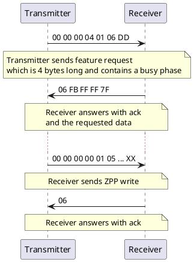

# ULF_SUSIV2

[](https://github.com/ZIMO-Elektronik/ULF_SUSIV2/actions/workflows/build.yml) [](https://github.com/ZIMO-Elektronik/ULF_SUSIV2/actions/workflows/tests.yml) [](https://github.com/ZIMO-Elektronik/ULF_SUSIV2/raw/master/LICENSE)


ULF_SUSIV2 is one of serval [ULF_COM](https://github.com/ZIMO-Elektronik/ULF_COM) protocols. It is used to perform [ZPP](https://github.com/ZIMO-Elektronik/ZPP) updates via the SUSI interface. SUSIV2 frames (basically [ZUSI](https://github.com/ZIMO-Elektronik/ZUSI) packets with a preceding header) are transmitted via a serial/CDC interface (e.g. from [ZSP](https://www.zimo.at/web2010/products/zsp_zimo-sound-programmer_EN.htm)) to a decoder update device where they are translated into physical ZUSI commands.

<details>
  <summary>Table of Contents</summary>
  <ol>
    <li><a href="#protocol">Protocol</a></li>
    <li><a href="#getting-started">Getting Started</a></li>
      <ul>
        <li><a href="#prerequisites">Prerequisites</a></li>
        <li><a href="#installation">Installation</a></li>
        <li><a href="#build">Build</a></li>
      </ul>
    <li><a href="#usage">Usage</a></li>
  </ol>
</details>

## Protocol
The protocol consists of only a single frame and is essentially a wrapper around [ZUSI](https://github.com/ZIMO-Elektronik/ZUSI) packets. The following header is prepended to the actual data.
| Length | Description                                                                              |
| ------ | ---------------------------------------------------------------------------------------- |
| 4 byte | Length of the expected answer in byte (not including the ack/nak byte)                   |
| 1 byte | 1 - ZUSI command contains a busy phase<br>0 - ZUSI command doesn't contains a busy phase |
| N byte | ZUSI packet                                                                              |

Each SUSIV2 frame is followed by a response. This consists of an [ack](./include/ulf/susiv2/ack.hpp) or [nak](./include/ulf/susiv2/nak.hpp) byte and any data sent by the decoder including the CRC8 checksum.



## Getting Started
### Prerequisites
- C++23 compatible compiler
- [CMake](https://cmake.org/) ( >= 3.25 )

### Installation
This library is meant to be consumed with CMake.

```cmake
#Either by including it with CPM
cpmaddpackage("gh:ZIMO-Elektronik/ULF_SUSIV2@0.1.2")

# or the FetchContent module
FetchContent_Declare(
  ULF_SUSIV2
  GIT_REPOSITORY "https://github.com/ZIMO-Elektronik/ULF_SUSIV2"
  GIT_TAG 0.1.2)
FetchContent_MakeAvailable(ULF_SUSIV2)

target_link_libraries(YourTarget PRIVATE ULF::SUSIV2)
```

### Build
:construction:

## Usage
To convert a SUSIV2 frame to a packet, `frame2packet` can be used. In order to be able to distinguish between an error case and the case where the data is still incomplete, the return value of the functions is `std::expected<std::optional<std::span<uint8_t>>, std::errc>`. If the pattern is not recognized at all, i.e. in the event of an error, then a `std::errc` is returned. If something is found but the data is not yet complete, a `std::nullopt` is returned. Otherwise the found data is returned as a non-owning view `std::span<uint8_t>`. The following snippet shows how `frame2packet` can be used.
```cpp
// Get ZUSI packet from SUSIV2 frame
auto maybe_packet{ulf::susiv2::frame2packet(frame)};

// Could be ZUSI packet
if (maybe_packet) {
  // Already complete?
  if (*maybe_packet) {
    // Complete ZUSI packet
    auto packet{**maybe_packet};
  }
  // No, still missing characters
  else {}
}
// Error, not ZUSI packet
else {}
```

A `Response` can be generated from a `Feedback` via `feedback2response`. The `Response` is preformatted and can be sent directly.
```cpp
// Create Response from Feedback
auto response{ulf::susiv2::feedback2response(feedback)};
```